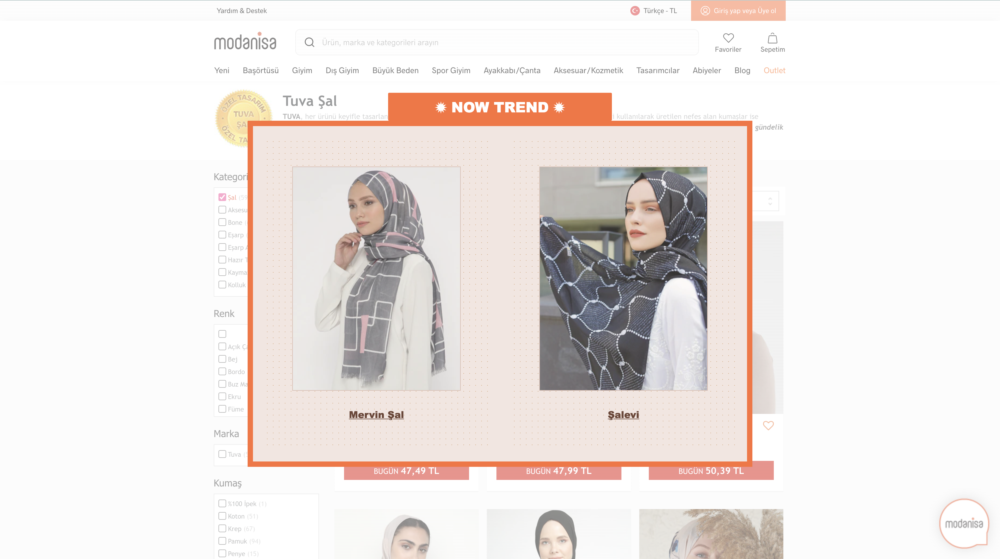

# "Şal" PRODUCTS



<br />

## **TITLES**
---
* [Description](#description)
* [Technologies](#technologies)
* [Setup](#setup)
* [Sources](#sources)

<br />

## Description
---
This project is UI design that displays products containing the name "şal". \
Using CSS flexbox, the entire post is aligned in the middle of the page \
The background image is taken from Modanisa.

<br />

## Technologies
---
Project is created with:
* **HTML5**
* **CSS3**
* **Javascript**

<br />

## Setup
---
Open it in chrome via terminal;


```
$ npm run start
```
or 

```
$ yarn start
```

<br />

## Sources
---
_https://css-tricks.com/snippets/css/a-guide-to-flexbox/_ \
_https://www.w3schools.com/_
