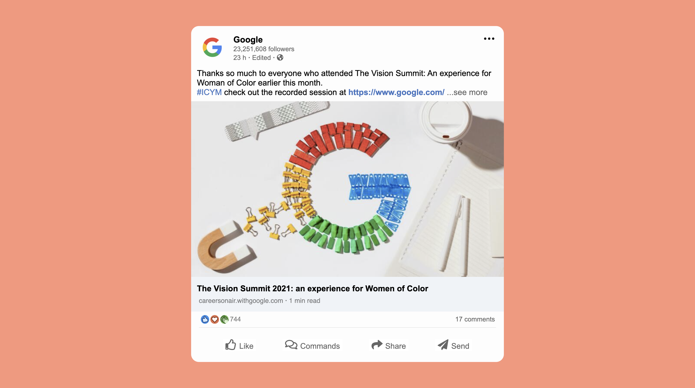

# LOGIN PAGE



<br />

## **TITLES**
---
* [Description](#description)
* [Technologies](#technologies)
* [Setup](#setup)
* [Sources](#sources)

<br />


## Description
---
This project is the UI design of a login page. \
Using CSS flexbox, the entire login card is aligned in the middle of the page, and the elements inside are grouped into columns. \
The flexbox of the entire login card is column, it contains a total of 2 rows. These rows are also divided into columns according to necessity. \
As for the promotion of the login card; it has the title "Login". \
In addition, there are 2 text inputs to get the username and password from the user. And there is a button for the login process, links that lead to the relevant pages for "forgot password" and "sign up" actions.

<br/>

## Technologies
---
Project is created with:
* **HTML5**
* **CSS3**

<br />

## Setup
---
Open it in chrome via terminal;


```
$ npm run start
```
or 

```
$ yarn start
```
<br />

## Sources
---
_https://css-tricks.com/snippets/css/a-guide-to-flexbox/_ \
_https://www.w3schools.com/_
